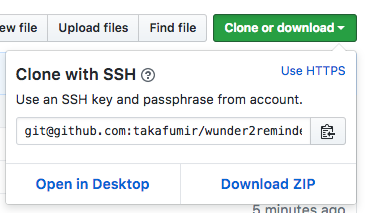
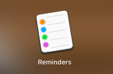
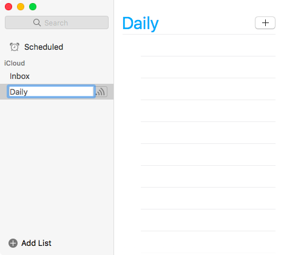
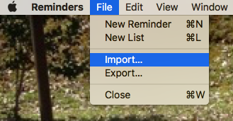
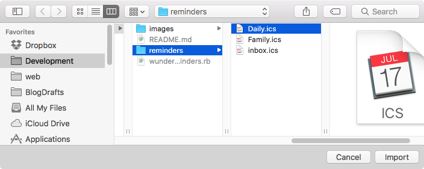
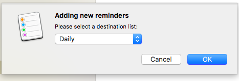

# Wunder2Reminders

Wunder2Reminders is a tool to transfer task data from Wunderlist into iCloud Reminders. Microsoft announced in April 2017 that they will shut down Wunderlist, so this tool helps people who want to move task data from Wunderlist into Reminders.


## Environments for operation check

- macOS Sierra 10.12.4
- Ruby 2.3.1


## Installation

1. Download wunder2reminders ZIP form this page.



2. Unzip the zip file.


## Usage

### 1. Back up Wunderlist.

Back up your Wunderlist task data. You can export the backup file from 'Account Settings -> Create Backup' on the Wunderlist website.

[Wunderlist | Can I backup / export my data?](https://support.wunderlist.com/customer/en/portal/articles/2364564-can-i-backup-export-my-data-)

Then, move the backup file to the wunder2reminders directory.

### 2. Run wunder2reminders.

Execute the following commands. Pass the Wunderlist backup file path as the argument.

```
$ cd /path/to/wunder2reminders
$ ./wunder2reminders.rb ./wunderlist-********-**-**-**.json
Daily
Family
inbox
...
```

Each list name shows up. You can use this list names in the next 3rd step to create lists in Reminders. 

In addition, task data files `reminders/*.ics` for iCloud Reminders are generated in the 'reminders' directory. Use these files to import task data into Reminders.


### 3. Create Lists in Reminders.

Launch the Reminders application on your Mac.



Then, click 'Add List' and create the lists for Reminders manually.




### 4. Import task data.

Import the task data files `reminders/*.ics` into Reminder. Select 'File -> Import'.



Select the task data file `reminders/*.ics`, and click the import button.



Select the target list for the task data file `reminders/*.ics`. Then, click the OK button.



Repeat these steps to import all `reminders/*.ics` files.


## Contribution

1. Fork it ( https://github.com/takafumir/wunder2reminders/fork )
1. Create your feature branch (git checkout -b my-new-feature)
1. Commit your changes (git commit -am 'Add some feature')
1. Push to the branch (git push origin my-new-feature)
1. Create a new Pull Request


## Licence

MIT License


## Author

[Takafumi Yamano](https://github.com/takafumir)
